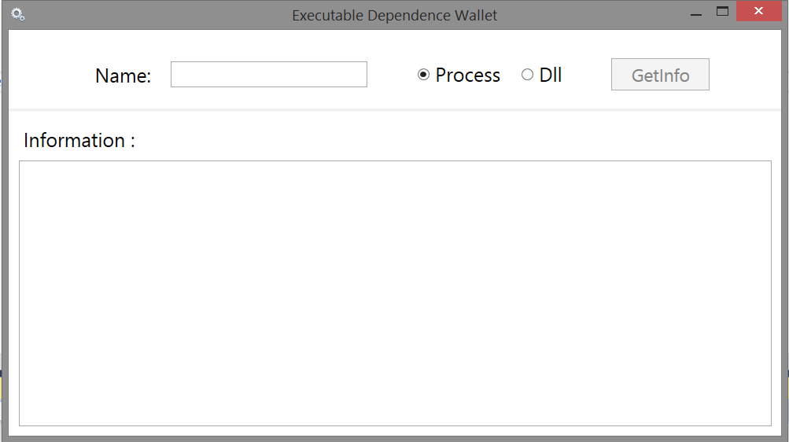
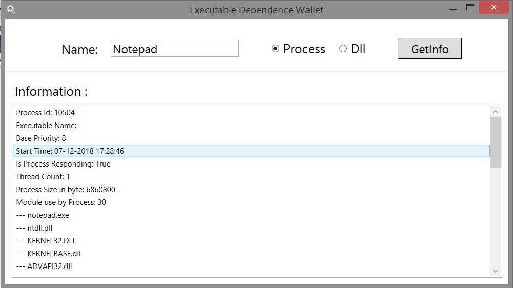
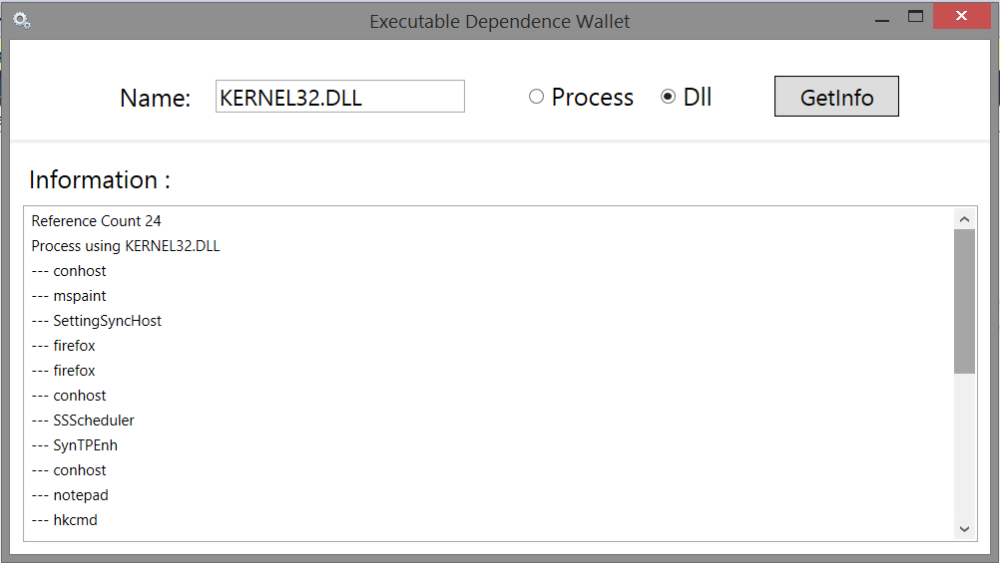

# Executable Dependence Wallet

It is desktop application use to fetching information of running process and dynamic linked library(DLL) on current system.

- __Framework:__ Dot Net.
- __Front End:__ Windows Presentation Foundation (WPF)
- __Back End:__ C#.
- __Platform:__ Windows.

---

## Features

- Providing all detail of running process like processId, Thread count, and list modules(DLL) used by that process.
- You also find the list of process which use specfied DLL.

---
## Project ScreenShot

1. First Look.

---

2. Displaying Information of specified Process(ie Notepad)

---

3. Displaying Information of specified DLL(ie KERNEL32.DLL)

---